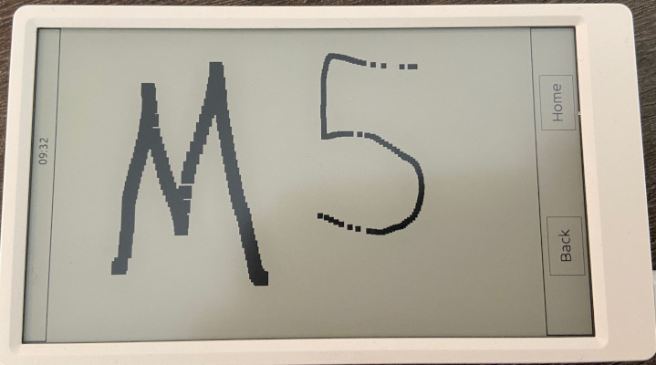
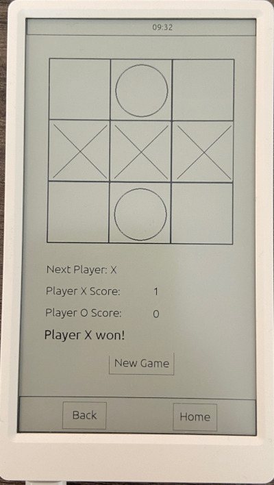

# M5PaperUI

This project is a proof-of-concept on how to build a UI framework for the
M5Paper device. The factory M5Paper device comes pre-loaded with an application
called "[FactoryTest](https://github.com/m5stack/M5Paper_FactoryTest)" that
shows very nicely how beautiful applications can look like on the device.

Initially, I tried to extend the code of the application to build my own
applications, but the code was not badly documented and did not feel very easy
to use and extend.

Since I wanted to understand better how to build similarity beautiful, but
better designed applications, I started on this project by trying to apply
well-known patterns that I've seen in other UI frameworks to the M5Paper.

The main difference I found between traditional UI frameworks and building a
framework for the M5Paper is that the E-Paper display behaves differently to
update the screen.

Usually, you would expect that on every loop iteration the screen is re-drawn
and this is done as often as the display refreshes. In contrast, refreshing the
e-paper display is an expensive operation, and issuing a refresh is only done
upon state changes. Furthermore, it is possible to refresh only a subset of the
whole screen much faster than the whole screen.


## The goal?

Provide a good sample library with lot's of documentation in the code that makes
it easier to learn about how to build UIs for e-paper displays.

## What now?

If you like the approach, take the code and fork it, extend it or built a better
version. If I ever figure out how to make this a platformio library, I'll try to
push it there.
## Architecture

On top of the stack is the `WidgetContext`, it keeps track of all known object
and its `Draw()` method should be invoked on every loop iteration.

Drawable objects are grouped in a `Frame`. A `Frame` contains a collection of
`Widgets` and must be registered in the `WidgetContext` before the `Frame` is
drawn for the first time. As long as a `Frame` is registered, its state is
available on subsequent reuse. All `Widgets` drawn on a `Frame` can share the
same canvas and delegate refreshing the canvas to the `Frame`. The upside is
fewer refresh events on the screen, but the downside is that the `Frame` can
only be updated in one operation rather than performing a partial refresh of the
screen.

The general idea of the refresh loop is outlined below. The key principle is
that even though `Frame::Draw()` or `Widget::Draw()` are executed on every
application loop iteration, they will only issue an actual event to the device
when the view is marked as dirty.

```
Loop:
  -> WidgetContext::Draw
    -> for Frame f in view_stack:
        -> f::Draw()
        -> for Widget w in f::widgets:
          -> w::Draw()
```

A `Widget` is the smallest drawable unit, a widget comes with traditional
properties like `WidgetStyle`, background color, text size etc. By default, the
Widget shares the canvas of the parent `Frame`. However, it is possible to make
the `Widget` use a separate canvas. One example for this use case is the
implementation of the `WButton`. The button has two states: normal and pushed.
If the button is in the normal state the regular canvas is drawn, if the button
is pushed a secondary canvas is pushed to the screen.


## Current Sample Applications

Right now, the following sample applications are part of the repository.

* Paint - A simple widget that can be embedded in any `Frame` and lets the user
  draw with their finger on the screen. In addition to drawing the line, the
  size of the line depends on the size of the touch events. Change the
  positioning of your finger on the screen to draw bigger or smaller arcs.

  
* Tic Tac Toe - Very simple implementation of the well-known game. The main idea
  behind this game is to show how to combine using the canvas of the parent
  frame together with individual other frames during partial refreshes of the
  screen.

  

